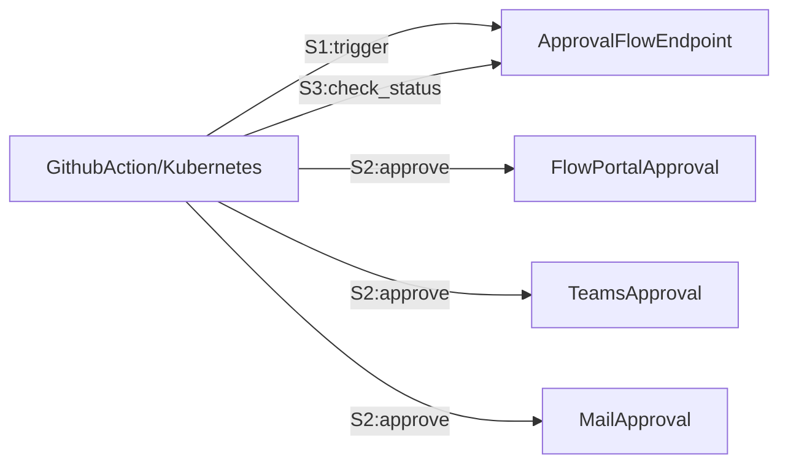

# E2E-Approval-Flow

This verification aims to confirm the end-to-end approval process.

Flow diagram

```mermaid
graph LR
    Playwright[GithubAction/Kubernetes]--S1:trigger-->ApprovalFlowEndpoint;
    Playwright[GithubAction/Kubernetes]--S2:approve-->FlowPortalApproval;
    Playwright[GithubAction/Kubernetes]--S2:approve-->TeamsApproval;
    Playwright[GithubAction/Kubernetes]--S2:approve-->MailApproval;
    Playwright[GithubAction/Kubernetes]--S3:check_status-->ApprovalFlowEndpoint;
```

Approval Flow

