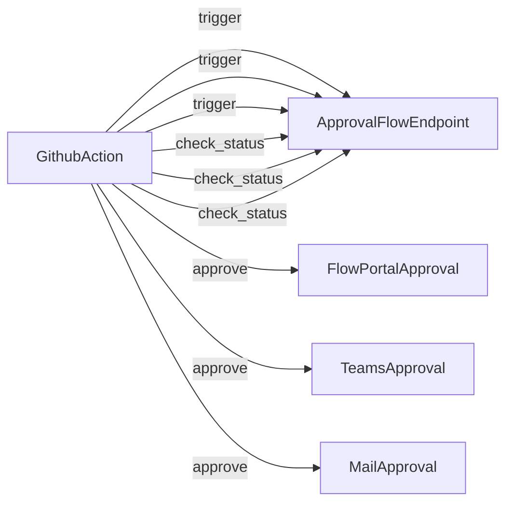

# E2E-Approval-Flow

This is for verifying the approval flow from end to end.

Flow diagram

```mermaid
graph LR
    Playwright[GithubAction]--trigger-->ApprovalFlowEndpoint;
    Playwright[GithubAction]--trigger-->ApprovalFlowEndpoint;
    Playwright[GithubAction]--trigger-->ApprovalFlowEndpoint;
    Playwright[GithubAction]--approve-->FlowPortalApproval;
    Playwright[GithubAction]--approve-->TeamsApproval;
    Playwright[GithubAction]--approve-->MailApproval;
    Playwright[GithubAction]--check_status-->ApprovalFlowEndpoint;
    Playwright[GithubAction]--check_status-->ApprovalFlowEndpoint;
    Playwright[GithubAction]--check_status-->ApprovalFlowEndpoint;
```