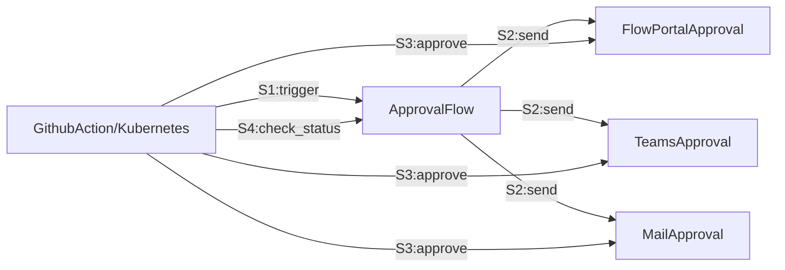

# E2E-Approval-Flow

The purpose of this verification is to ensure the end-to-end functionality of the approval process.
It can be deployed on k8s or GitHub Actions.

#### Flow diagram

#### Approval Flow

#### Tools
- [Power Automate](https://powerautomate.microsoft.com/)
- [Approvals](https://learn.microsoft.com/en-us/connectors/approvals/)
- [Playwright](https://playwright.dev/python/)
- [Github Actions](https://github.com/actions)
- [Kubernetes](https://kubernetes.io/)
- [Docker](https://www.docker.com/)
